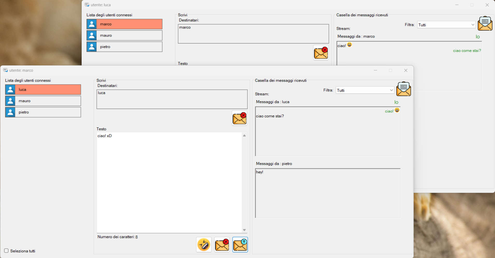

# TCPChat

A multithreaded TCP-based multiuser chat

# Description
This repository contains a project that implements a TCP chat application where multiple users can connect and exchange messages in real-time. The server is multithreaded, meaning it can handle multiple clients simultaneously.

Once a client is connected, users can view the list of other connected users and start private chats with them.
